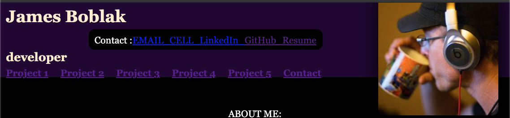
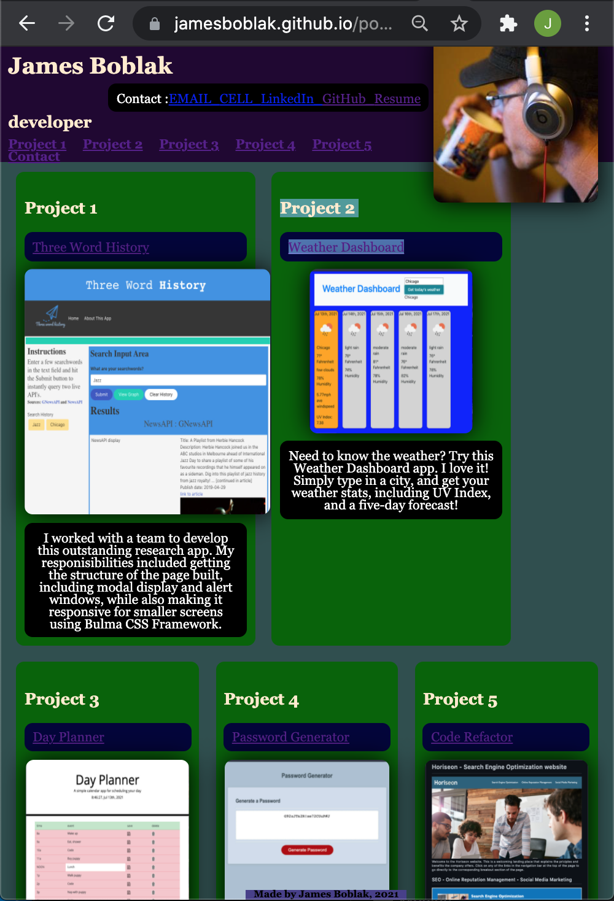

# James Boblak portfolio-rework/
## Welcome
[Link to open app in browser](https://jamesboblak.github.io/portfolio-rework/)  

James Boblak, full stack developer, portfolio  
  
<!-- Header image -->
\
The Header features links to project details within the page, as well as contact information.  

<!-- Body information -->
  
The body of the page auto-sizes down to accommodate any screen size without sacrificing text or image size.  

<!-- Card information -->
  
Each of the code titles in the Project cards links directly to its GitHub repository, and the images link to the pages themselves.  The last two are presently placholders, which link to my portfolio page.  

<!-- Statement of purpose -->
## Purpose
I am forever updating this site to reflect the evolution of my career and craft.  Please fork any repositories you like, and also feel free to comment or reach out.  I am also happy to help be a Rubber Duck for your designs at the very least!

## Technology utilized to create this page:
<!-- HTML Pionts -->
* HTML
    * Semantic tagging
    * Sectional commenting
    * Internal and external linking

    <!-- CSS Points -->
* CSS
    * Concise use of Classes and ID's
    * Variables defined for radius and margin/padding settings
    * Flex-box architecture
    * Mouse event listeners

<!-- Browser compatiblity -->
## Compatiblity and Installation
This HTML website and its CSS style document was created and tested in Chrome, but will load in any browser.  Most modern browsers should play the content of this page as intended, and without issue.  Firefox however can be sniffy about flex!

## Credits:
UCBerkeley Code Camp, w3schools.com, developer.mozilla.org

## License
GNU General Public License v3.0

## Badges
